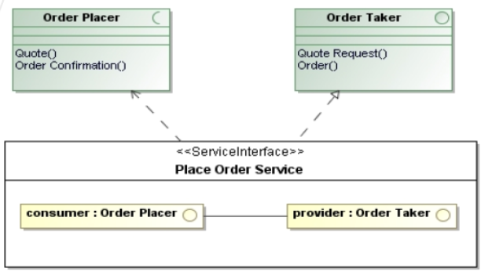
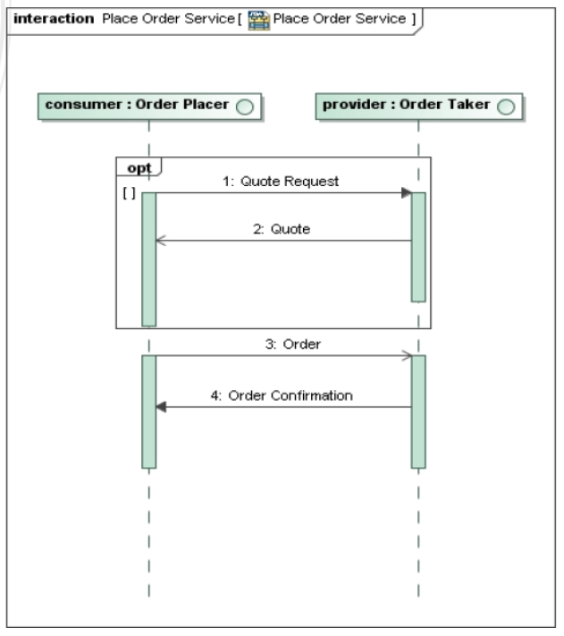
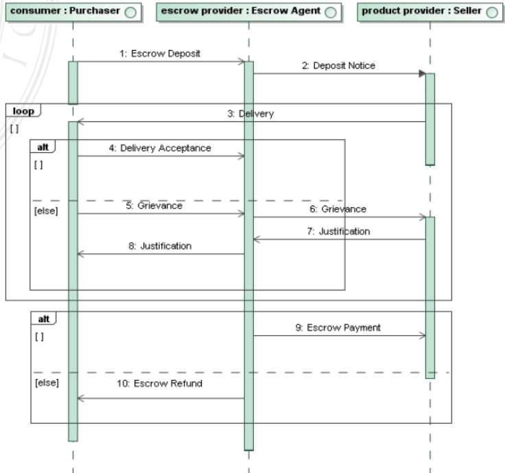
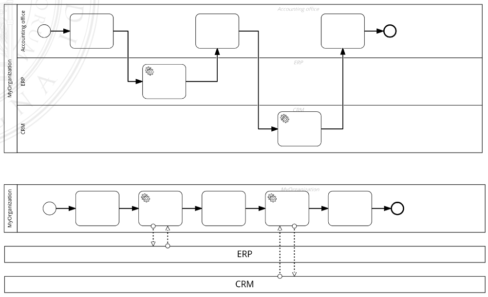

# 5. SOA Enterprise

È tipicamente progettata in maniera top-down con unico stack tecnologico (come Java EE o Dot.net). Usa SOAP. Ha una governance definita. Dal punto tecnico si fanno affidamento su componenti come l'ESB.

Il documento OASIS SOA RM è un reference model definito da un ente che gestisce le politiche di gestione: la definizione di essa (devo essere fatte valere, quindi bisogna verificarla/misurarla), identificazione del responsabile, verifica che vengano attuate (tecnicamente misurabili o con una forma di review fatta da persone).

Le politiche possono essere definite in base al 
- design-time: versionamento, interfacce, codici, documentazione, ritiro.
- runtime: sicurezza, performance.

Si parte dall'idea del business e poi si raffina la struttura. Usando un approccio top-down si hanno
- pro: le goverance sono più pulite visto che si "vede dall'alto tutto quanto"; con questa visione globale si ha anche un modo di affronto migliore dei rischi.
- cons: la parte di pianificazione e modellazione divengono più complesse; bisogna far valere le policy, diventando alquanto tedioso; sono pensane per funzionare tutto-o-niente; la consegna è lenta.

In sommo, il business è il dominio del problema, mentre l'IT è la soluzione a tale problema. Si deve trovare un modo di correlare problema-soluzione. Per far vedere le caratteristiche del problema che devono essere supportate si usa un classico modello top-down:
1. caratterizzazione del problema (analisi) modellando dominio;
2. identificazione dei servizi che servono;
3. specificazione dei modelli, vedono il comportamento ma anche le strutture delle interfacce e delle dipendenze.

Si modella con un approccio basato sui processi (grazie BPMN).

## SOMA
È 1 dei 105 modi possibili (stando ad articolo del 2014) per identificare i servizi. Modellando in modo strutturale si può usare un UML non standard oppure SoaML (specifica di OMG, usata poco).

### SoaML
Specifica caratteristiche strutturati e funzionali di un servizio nel medesimo modo in cui sono esposti ai consumatori. Si identificano servizi, requisiti e dipendenze, oltre che le politiche.
È sia un profilo (si può usare il modellatore UML classico) ché un'estensione (serve uno ad-hoc) di UML. 

le interfacce sono necessarie e si vedono come vengono relazionati i servizi. Dentro `ServiceInterface` si vede il ruolo delle relazioni (consumatore/produttore in questo caso). Questa relazione è la definizione di coreografie. 

I diagrammi di sequenza sono avanzati abbastanza da essere usati per le coreografie.

si ha però una meno espressività rispetto a quanto visto su BPMN.
L'idea di SoaML è dunque di mettere insieme l'aspetto strutturale e allo stesso tempo definire come comunicano i partner.

Un servizio è composto dal modello computazione "capability" e l'interfaccia che permette di definire ciò.
Le architetture service-based possono essere definite in livelli di astrazioni: in questo caso però i livelli comunicano fra di loro senza il bisogno che siano direttamente vicini (il 1° può comunicare direttamente col 3°). In base vi sono quelli più astratti (come la gestione del database). A livello più alto vi sono quelli che espongono una "capability" che fa una wrap a una capability esterna.
I servizi intermedi non fanno wrapping di interi processi business, ma al massimo di una singola funzione del sistema informatico. Spesso processi agnostici in cui non si sanno dove sono però possono  essere ri-utilizzabili. Loro hanno elementi del dominio.
Il livello più basso è dato ai servizi di utilità in cui sono generiche e non hanno gli elementi del dominio.

Se c'è l'interfaccia che espone la capability si ha la sicurezza che il servizio funziona.

## SOMA
Proprietaria di IBM: ipertesto che definisce cosa fa ogni attività, cos'è un artifatto. È una metodologia ispirata a RUP (anch'essa IBM). SOMA definisce 4 pratiche:
1. casi d'uso, espressi attraverso i processi che caratterizzano l'organizzazione (BPMN insomma);
2. identificazione dei servizi, legato al punto 1;
3. specifica dei servizi, strutturale e comportamentale;
4. realizzazione.

Ad ogni processo si cerca di associare un task service (servizio al alto livello che espongono un intero processo come capability).

Ogni messaggio in entrata è una nuova operazione. 

Una lane è una risorsa dell'organizzazione, dunque si può fare una per ogni servizio e spostare le operazioni nella lane corrispondente. Oppure non si fa nulla e si vede solo come comunica usando i pool.

