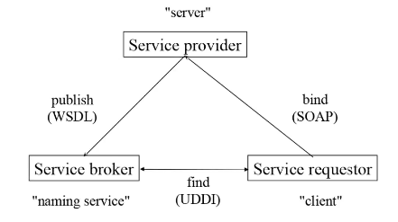

# 8. SOAP

Lo standard dei servizi web, un supporto all'esecuzione dell'applicazione, sfrutta SOAP.
L'architettura in parte ancora mantenuta è data da:


Il service provider è il server che mette online l'app (eg: Google con Maps).
Il service requestor è chi fa la richiesta al servizio (eg: l'utente che accede a Maps).
Il service broker fornisce le informazioni per collegarsi ad un servizio. Il server deve pubblicare le interfacce nel broker. UDDI è il protocollo usato per andare a trovare i servizi.

Quest'ultimo non ha preso troppa parte: in genere è il client che ricerca il servizio.

Gli intermediari tra client-server possono guardare i metadati: SOAP è stato creato con l'idea di lavorare con ciò. Si appoggia a livelli di trasporto classici come TCP.
L'interfaccia WSDL può essere usata usando SOAP.
Un payload di SOAP è composto da
- carry: pezzo XML;
- header: info addizionali, come se vogliamo parlare di sicurezza, con quale chiave è firmato, se parte di una transazione lunga.

Anche se scritto in XML bisogna poter interagire con altri formati perché ci potrebbero essere, ad esempio, tanti standard sulla sicurezza. Negli header vi sono dunque altri schema, come `WS-Security`.
I fault (errori di vario genere) sono specificati e spiega come far notificare l'errore.

Si invoca un metodo/funzione mediante RPC over HTTP. Si può usare in multi-cast o cose più complicate.

Un esempio di richiesta è formata come:
```xml
<?xml version='1.0' ?>
<soapenv:Envelope xmlns:soapenv="http://schemas.xmlsoap.org/soap/envelope/" xmlns:xsd="http://www.w3.org/2001/XMLSchema" xmlns:xsi="http://www.w3.org/2001/XMLSchema-instance">
	<soapenv:Body>
		<ns1:echo soapenv:encodingStyle="http://schemas.xmlsoap.org/soap/encoding/" xmlns:ns1="http://.../axis/services/EchoService">
			<in0 xsi:type="xsd:string">Hollow World</in0>
		</ns1:echo>
	</soapenv:Body>
</soapenv:Envelope>
```

mentre una risposta del tipo:

```xml
<?xml version='1.0' ?>
<soapenv:Envelope xmlns:soapenv="http://schemas.xmlsoap.org/soap/envelope/" xmlns:xsd="http://www.w3.org/2001/XMLSchema" xmlns:xsi="http://www.w3.org/2001/XMLSchema-instance">
	<soapenv:Body>
		<ns1:echoResponse soapenv:encodingStyle="http://schemas.xmlsoap.org/soap/encoding/" xmlns:ns1="http://../axis/services/echoService">
			<echoReturn xsi:type="xsd:string">Hollow World</echoReturn>
		</ns1:echoResponse>
	</soapenv:Body>
</soapenv:Envelope>
```

dunque si ha uno strato di `envelope` con all'interno un `header` e un `body`. Dentro il `body` troviamo il messaggio.
In Jolie non si devono specificare i tipi perché li riconosce dalle interfacce.

Gli header sono punti di estensione, sono degli attributi che specificano informazioni come `env:role` e `env:mustUnderstand` in cui vi, ad esempio, si una reference ad un uuid per dei messaggi.

I ruoli di default sono:
- `None` SOAP non guarda il ruolo;
- `Next` sia destinatario finale che gli intermediari;
- `UltimateReceiver` solo il destinatario finale.

SOAP notifica gli errori mediante dei tag opportuni.
```xml
<soapenv:Body>
	<soapenv:fault>
		<faultcode>soapenv:server</faultcode>
		<faultstring>...</faultstring>
	</soapenv:fault>
</soapenv:Body>
```